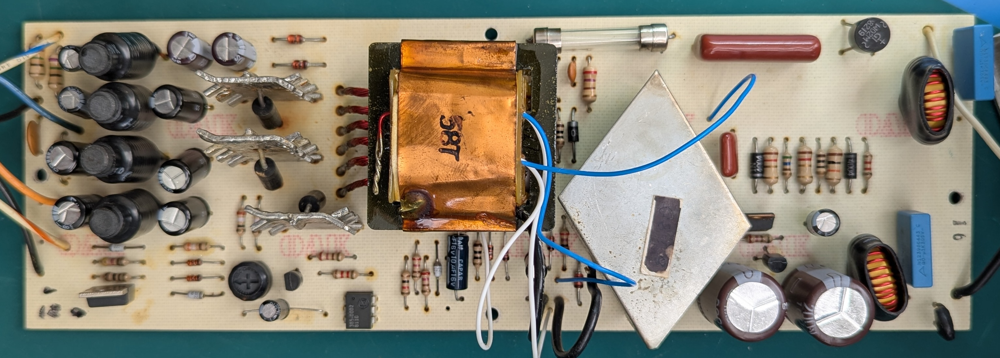
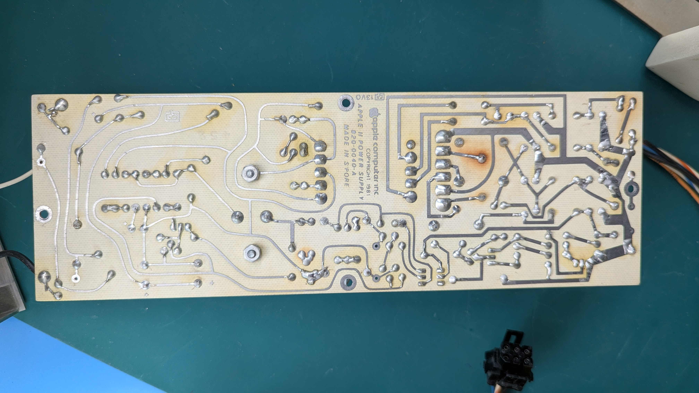
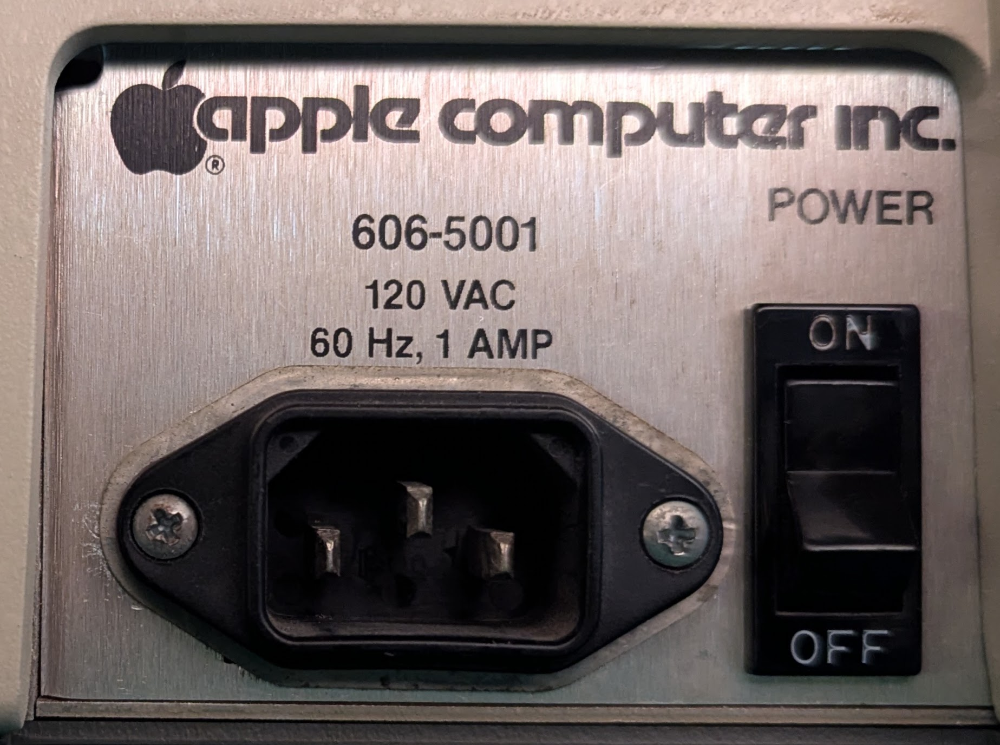
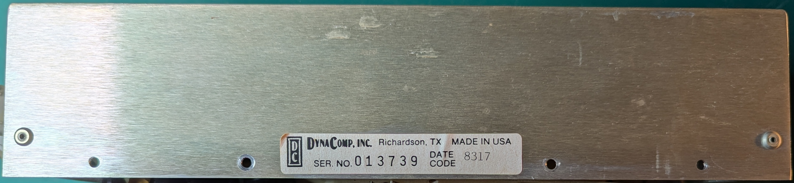

# Apple ][ 605-5703 (DynaComp 606-5001) Power Supply 110v

- KiCad schematic reverse-engineered by Fred Sauer in 2025.

- Part numbers and compontent layout match power supply schematic published in
  _The Apple II Circuit Description_ (reprint of _Apple II Reference Manual 1981_),
  except for minor differences indicated on the schematic by `????` and `****`.

- Refer to [U.S. Patent 4,130,862](https://patents.google.com/patent/US4130862A)
  for an explanation of key design features of this power supply.

- KiCad and PDF schematic can be found in the `Dyna-Comp-606-5001-KiCad/` folder.

Circuit board top side:

Circuit board bottom side:

Model number `606-5001`

Specifications: `120 VAC` `60 Hz, 1 AMP`

Made in `DynaComp, Richardson, TX`:

