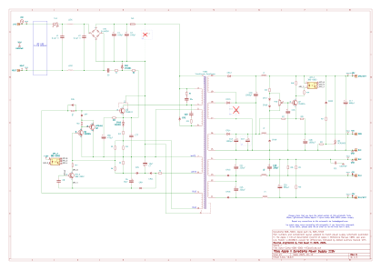
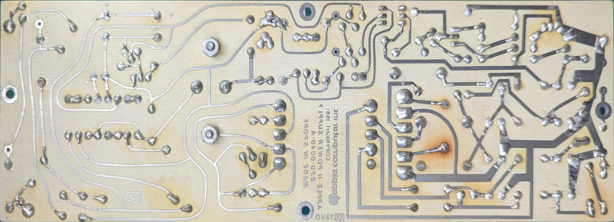
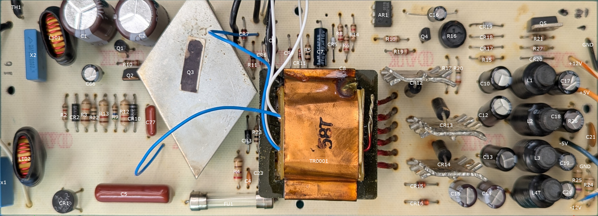
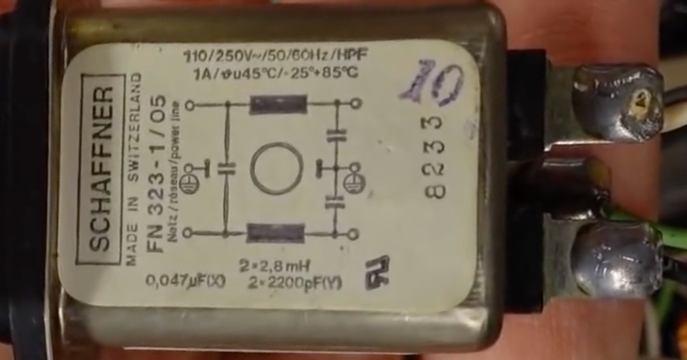
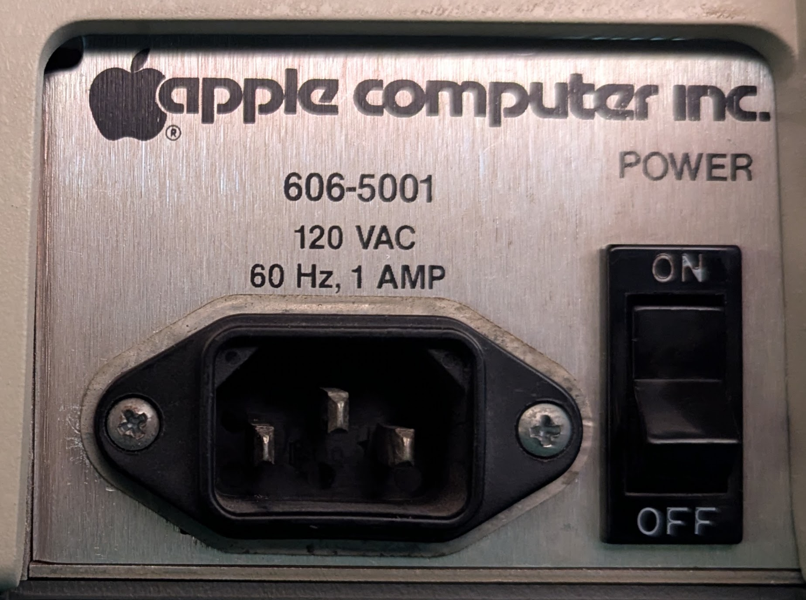
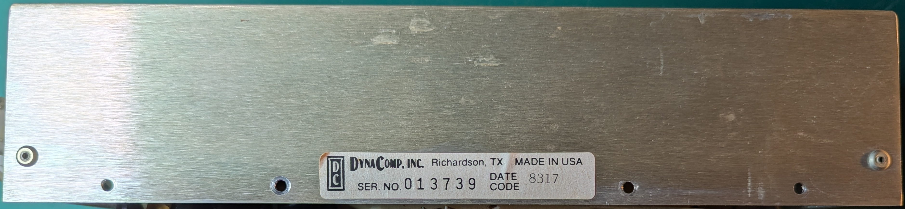

# Apple II 605-5703 (DynaComp 606-5001) Power Supply 110v

- KiCad schematic reverse-engineered by Fred Sauer in 2025, 2026.

- Part numbers and compontent layout updated to match power supply schematic
  published in _The Apple II Circuit Description_ (reprint of
  _Apple II Reference Manual 1981_), except for differences indicated by dotted
  outlines marked `diff`.

- Refer to [U.S. Patent 4,130,862](https://patents.google.com/patent/US4130862A)
  for an explanation of key design features of this power supply.

- KiCad and PDF schematic can be found in the `Dyna-Comp-606-5001-KiCad/`
  folder.

<table>
  <caption>KiCad schematic</caption>
  <tr>
    <td>
      <a href="Dyna-Comp-606-5001-KiCad.svg">Dyna-Comp-606-5001-KiCad.svg</a> 
      <a href="Dyna-Comp-606-5001-KiCad.pdf">Dyna-Comp-606-5001-KiCad.pdf</a> 
    </td>
  </tr>
  <tr>
    <td></td>
  </tr>
</table>

<table>
  <caption>Main circuit board</caption>
  <tr>
    <td>Bottom side (flipped)</td>
    <td>Top side</td>
  </tr>
  <tr>
    <td></td>
    <td></td>
  </tr>
</table>

<table>
  <caption>Line filter</caption>
  <tr>
    <td></td>
  </tr>
</table>

Model number `606-5001`

Specifications: `120 VAC` `60 Hz, 1 AMP`

Made in `DynaComp, Richardson, TX`:

<table>
  <caption>Line filter</caption>
  <tr>
    <td></td>
    <td></td>
  </tr>
</table>

